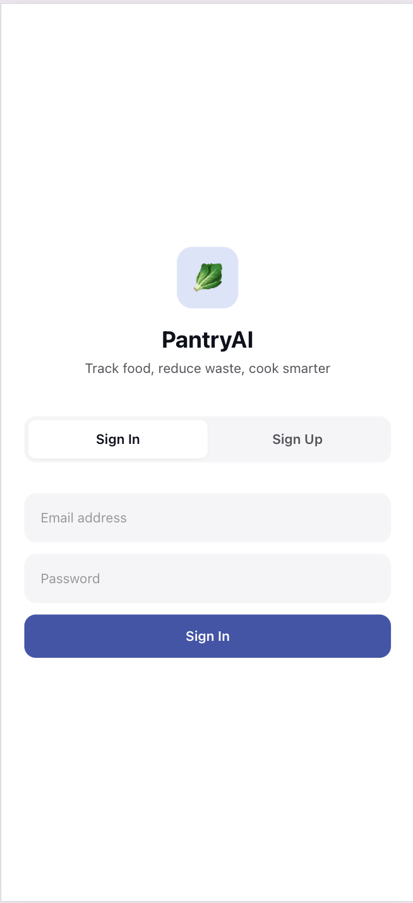
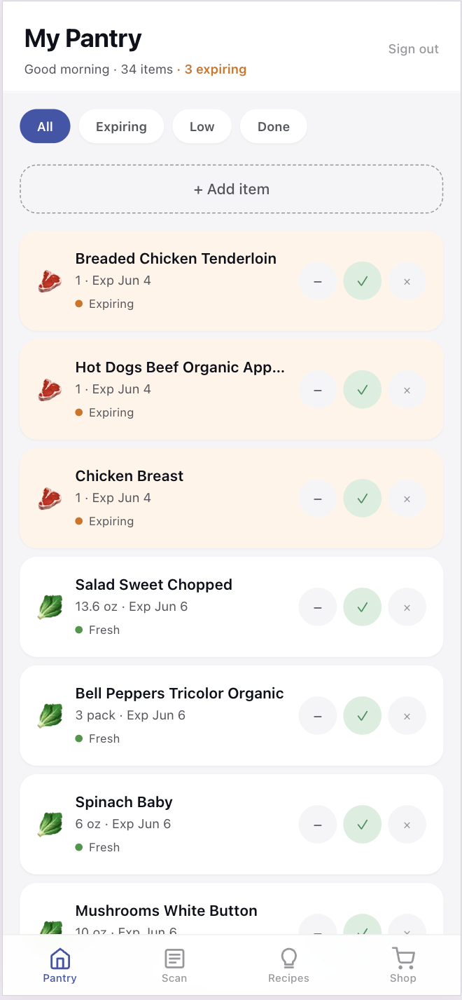
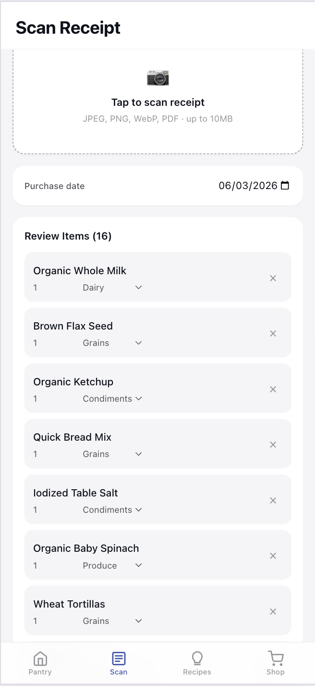
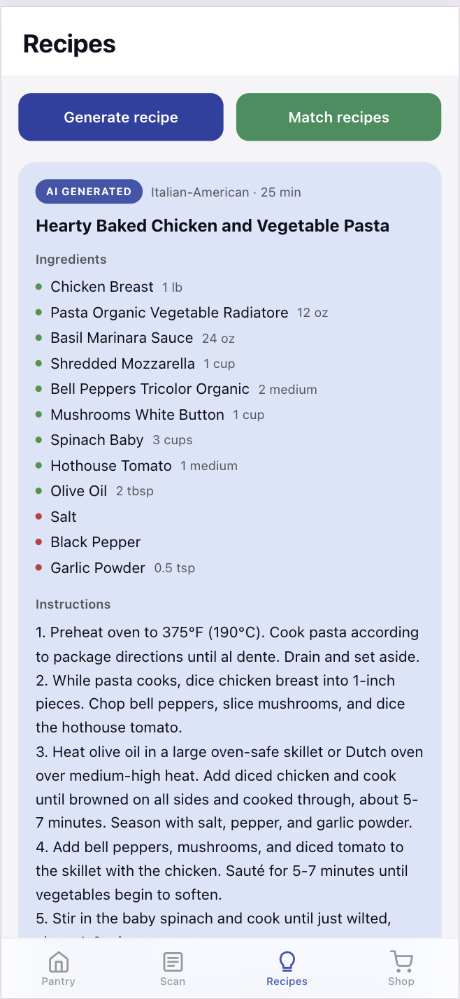

# PantryAI

**Turn a grocery receipt photo into a living pantry — with AI-powered expiry tracking, recipe suggestions, and daily push reminders.**

PantryAI is a mobile-first web app for college students who want to waste less food. Scan a receipt after a grocery run, and the app builds your inventory automatically: item names normalized, categories assigned, expiry dates estimated. From there it surfaces what's expiring, suggests recipes that use what you already have (prioritizing items close to expiry), and builds a shopping list for anything missing.

---

## Screenshots

<p align="center">
  
  &nbsp;
  
  &nbsp;
  
  &nbsp;
  
</p>

| Screen | What it shows |
|---|---|
| **Sign In** | Supabase Auth — email/password, tab-switched sign-up |
| **My Pantry** | 34 items sorted by estimated expiry. Items within 2 days of expiry get an amber tinted card and a "3 expiring" count in the header (computed server-side from purchase date + per-category shelf-life constants, never stored). Filter chips scope the view to Expiring / Low / Done. |
| **Scan Receipt** | After uploading a real grocery receipt: Tesseract OCR extracts the text, Gemini 2.5 Flash parses it into 16 structured items with normalized names (`CHKN BRST` → `Chicken Breast`) and auto-assigned categories. The user can edit any field or remove rows before confirming. |
| **Recipes** | Gemini 2.5 Flash generates a custom recipe from the current pantry ("Hearty Baked Chicken and Vegetable Pasta", 25 min). Green dots = ingredients already in pantry; red dots = items to buy. A separate "Match recipes" button runs the RAG pipeline instead. |


---

## How it works

### Receipt → Inventory pipeline

1. User uploads a photo (JPEG/PNG/WebP/PDF, ≤10 MB)
2. **Tesseract OCR** extracts raw text from the image
3. **Gemini 2.5 Flash** parses the OCR output: normalises item names (`CHKN BRST` → `Chicken Breast`), assigns one of 9 categories, and returns structured JSON
4. The user reviews the extracted items in an editable list before confirming
5. On confirm, items are upserted into inventory with expiry dates estimated per category (Protein: 3 days, Produce: 5 days, Dairy: 10 days, Frozen: 90 days, etc.)
6. **RapidFuzz** fuzzy-matches new items against existing inventory (≥85% score) to accumulate quantity instead of creating duplicates

### Recipe suggestions — RAG pipeline

1. Active pantry items are joined into a query string and embedded with **`all-MiniLM-L6-v2`** (384 dimensions, via `sentence-transformers`)
2. **pgvector** runs a cosine-similarity search across the recipe corpus (ivfflat index), returning the top 20 candidates
3. **Gemini 2.5 Flash** re-ranks the 20 candidates against the full inventory, computing a `match_score` (fraction of required ingredients present), applying fuzzy ingredient matching (`heavy cream` matches `cream`), and prioritising recipes that use `expiring_soon` items
4. Returns the top 5 suggestions with per-recipe lists of matched pantry items and missing ingredients

### AI recipe generation

When no database recipe fits, Gemini generates a custom recipe from scratch against the user's current pantry. It maximises use of available ingredients (especially expiring ones), specifies what needs to be bought, and returns numbered step-by-step instructions.

### Daily push notifications

A **Supabase Edge Function** (Deno runtime) runs on a daily cron at 8 AM. It queries for inventory items expiring the next day, groups them by user, and sends a **Web Push** notification to each user's registered subscription. The service worker intercepts the push and shows a system notification; tapping it opens `/dashboard`.

---

## Tech stack

| Layer | Technology |
|---|---|
| Frontend | Next.js 14 (App Router), TypeScript, Tailwind CSS |
| Backend | FastAPI (Python 3.11), Uvicorn, Docker |
| Database | Supabase (PostgreSQL), Row-Level Security |
| Vector search | pgvector — ivfflat index, cosine similarity |
| OCR | Tesseract via `pytesseract` + Pillow |
| LLM | Google Gemini 2.5 Flash (structured JSON output) |
| Embeddings | `sentence-transformers` — `all-MiniLM-L6-v2` (384-dim) |
| Fuzzy match | RapidFuzz |
| Auth | Supabase Auth (email/password, JWT) |
| Push notifications | Web Push API, Supabase Edge Functions (Deno) |
| Rate limiting | slowapi (per user ID, falls back to IP) |

---

## Architecture

```
┌─────────────────────────────────────────────────────┐
│  Next.js 14 (App Router)                            │
│  Mobile-first PWA · 428px · Bottom tab nav          │
└─────────────────┬───────────────────────────────────┘
                  │ REST (JWT in Authorization header)
┌─────────────────▼───────────────────────────────────┐
│  FastAPI                                            │
│  /api/receipts   /api/inventory                     │
│  /api/recipes    /api/shopping   /api/notifications │
│                                                     │
│  ┌──────────────┐  ┌──────────────┐                 │
│  │ receipt_agent│  │ recipe_agent │                 │
│  │ Tesseract OCR│  │ MiniLM embed │                 │
│  │ Gemini Flash │  │ Gemini Flash │                 │
│  └──────────────┘  └──────────────┘                 │
└─────────────────┬───────────────────────────────────┘
                  │
┌─────────────────▼───────────────────────────────────┐
│  Supabase (PostgreSQL + pgvector)                   │
│                                                     │
│  profiles          receipts                         │
│  inventory_items   recipes (384-dim embeddings)     │
│  shopping_lists    push_subscriptions               │
│                                                     │
│  RLS on all user-data tables                        │
│  ivfflat index on recipes.embedding                 │
└─────────────────────────────────────────────────────┘
                  │
┌─────────────────▼───────────────────────────────────┐
│  Supabase Edge Function (Deno)                      │
│  daily-expiry-push — cron 8 AM                      │
│  Web Push → service worker → system notification    │
└─────────────────────────────────────────────────────┘
```

---

## Database schema

```sql
profiles          -- extends Supabase auth.users (auto-created on signup)
receipts          -- raw OCR text, store name, extracted items (JSONB), metadata
inventory_items   -- name, category, quantity, unit, purchase_date, estimated_expiry, status
recipes           -- title, ingredients (JSONB), instructions, cuisine, embedding VECTOR(384)
shopping_lists    -- recipe_title, items (JSONB with checked state)
push_subscriptions
recipe_suggestion_log  -- for measuring suggestion quality
```

Row-Level Security is enforced on all six user-data tables. Ownership checks on mutations always return **404** (not 403) — 403 reveals that a resource exists and belongs to someone else, which is useful to an attacker; 404 reveals nothing.

---

## Security

- **JWT verification** on every API endpoint via Supabase's JWKS
- **Row-Level Security** — Supabase RLS policies ensure users can only read/write their own rows, enforced at the database level independently of application logic
- **Ownership assertion** — every mutating endpoint re-verifies ownership server-side before writing, returning 404 on mismatch
- **Rate limiting** — per user ID (falls back to IP for unauthenticated requests): receipts 10/hour, inventory 60–120/hour
- **Field allowlist** — PATCH `/inventory/:id` only accepts `quantity`, `is_finished`, `unit`; all other keys are silently dropped
- **File validation** — MIME type and size checks before any OCR or storage write

---

## Key design decisions

**Expiry estimation, not tracking.** Real expiry dates require user input on every item. Instead, the app uses per-category shelf-life constants (backed by FDA guidelines) applied from purchase date. This means zero friction at scan time — expiry is always populated.

**LLM as parser, not gatekeeper.** Gemini only touches the receipt OCR text and recipe ranking. The rest of the pipeline (upsert logic, status computation, ownership checks) is deterministic Python. The LLM is isolated to a single agent module per domain so it can be swapped or tested independently.

**RAG before generation.** Recipe matching runs against a seeded corpus first (vector search → LLM re-rank), which is faster and more predictable. Generation (full Gemini creative pass) is a separate button the user explicitly triggers.

**Fuzzy dedup on upsert.** When a receipt adds `Chicken Breast` and the pantry already has `Chicken Brst`, RapidFuzz catches the match at ≥85 score and accumulates quantity rather than creating a duplicate row. This keeps the inventory accurate across multiple receipt scans.

---

## Local setup

### Prerequisites

- Node.js 18+
- Python 3.11+
- Docker (for backend)
- Supabase project with the migrations applied
- Tesseract installed (`brew install tesseract` on macOS)
- Google AI API key (Gemini)

### 1. Supabase

Run migrations in order:

```bash
supabase db push  # or apply 001_initial.sql, 002_rls.sql, 003_nullable_recipe_id.sql manually
```

Then seed the recipe corpus:

```bash
cd backend
pip install -r requirements.txt
python scripts/seed_recipes.py   # embeds recipes and inserts into Supabase
```

### 2. Backend

```bash
cp .env.example .env
# Fill in: SUPABASE_URL, SUPABASE_SERVICE_ROLE_KEY, SUPABASE_JWT_SECRET, GEMINI_API_KEY

docker-compose up --build
# API available at http://localhost:8000
```

Or without Docker:

```bash
cd backend
uvicorn main:app --reload --port 8000
```

### 3. Frontend

```bash
cd frontend
cp .env.local.example .env.local
# Fill in: NEXT_PUBLIC_SUPABASE_URL, NEXT_PUBLIC_SUPABASE_ANON_KEY, NEXT_PUBLIC_API_URL

npm install
npm run dev
# App at http://localhost:3000
```

### 4. Push notifications (optional)

Generate VAPID keys and configure them in your Supabase Edge Function environment. Deploy:

```bash
supabase functions deploy daily-expiry-push
# Schedule via Supabase dashboard → Database → Cron Jobs
```

---

## Project structure

```
pantryai/
├── frontend/
│   ├── app/
│   │   ├── page.tsx              # Auth (sign in / sign up)
│   │   ├── dashboard/page.tsx    # Pantry inventory
│   │   ├── receipts/page.tsx     # Receipt scanning
│   │   ├── recipes/page.tsx      # Recipe suggestions + generation
│   │   └── shopping/page.tsx     # Shopping lists
│   ├── components/
│   │   ├── Nav.tsx               # Bottom tab bar
│   │   └── StatusBadge.tsx       # Expiry status chip
│   ├── lib/
│   │   ├── api.ts                # Typed API client
│   │   ├── supabase.ts           # Supabase browser client
│   │   └── types.ts              # Shared TypeScript types
│   └── public/sw.js              # Service worker (push notifications)
│
├── backend/
│   ├── main.py                   # FastAPI app, CORS, rate limit middleware
│   ├── agents/
│   │   ├── receipt_agent.py      # Tesseract OCR → Gemini parse
│   │   ├── recipe_agent.py       # MiniLM embed → pgvector → Gemini re-rank
│   │   ├── inventory_agent.py    # Expiry estimation, fuzzy dedup, status compute
│   │   └── shopping_agent.py
│   ├── routers/
│   │   ├── receipts.py           # POST /upload, POST /:id/confirm, GET /
│   │   ├── inventory.py          # GET /, GET /expiring, PATCH /:id, DELETE /:id, POST /manual
│   │   ├── recipes.py            # POST /suggest, POST /generate
│   │   ├── shopping.py           # CRUD + toggle item
│   │   └── notifications.py      # POST /subscribe
│   └── services/
│       ├── auth.py               # JWT verification
│       ├── ownership.py          # Resource ownership assertion
│       ├── ocr.py                # Tesseract wrapper
│       ├── embeddings.py         # sentence-transformers wrapper
│       ├── rate_limiter.py       # slowapi config
│       └── supabase_client.py    # Admin client
│
├── supabase/
│   ├── migrations/               # 001 schema, 002 RLS, 003 nullable fix
│   └── functions/
│       └── daily-expiry-push/    # Deno edge function, Web Push cron
│
└── docker-compose.yml
```

---

## API reference

| Method | Endpoint | Description |
|---|---|---|
| `POST` | `/api/receipts/upload` | Upload receipt image; returns extracted items for review |
| `POST` | `/api/receipts/:id/confirm` | Confirm (and optionally edit) extracted items; writes to inventory |
| `GET` | `/api/receipts/` | List past receipts |
| `GET` | `/api/inventory/` | List all inventory items (sorted by expiry, status computed) |
| `GET` | `/api/inventory/expiring` | Items expiring within 3 days |
| `POST` | `/api/inventory/manual` | Add item without a receipt |
| `PATCH` | `/api/inventory/:id` | Update quantity, unit, or is\_finished |
| `DELETE` | `/api/inventory/:id` | Remove item |
| `POST` | `/api/recipes/suggest` | RAG pipeline: returns top-5 matched recipes |
| `POST` | `/api/recipes/generate` | Gemini generates a custom recipe from current pantry |
| `GET` | `/api/shopping/` | List shopping lists |
| `POST` | `/api/shopping/` | Create shopping list from missing ingredients |
| `PATCH` | `/api/shopping/:id/toggle` | Check/uncheck a shopping list item |
| `POST` | `/api/notifications/subscribe` | Register Web Push subscription |

---

## UI

The frontend is a mobile-first PWA with a 428 px max-width, bottom tab navigation, and iOS safe-area insets. The design system uses OKLCH colour tokens — a deep plum primary (`oklch(0.48 0.14 270)`) and sage green accent (`oklch(0.58 0.12 155)`) — with a system font stack (`-apple-system`, `SF Pro Text`, `system-ui`) and a native iOS feel throughout. All touch targets are ≥44 px. Reduced-motion is respected globally.

---

## License

MIT — see [LICENSE](LICENSE).
